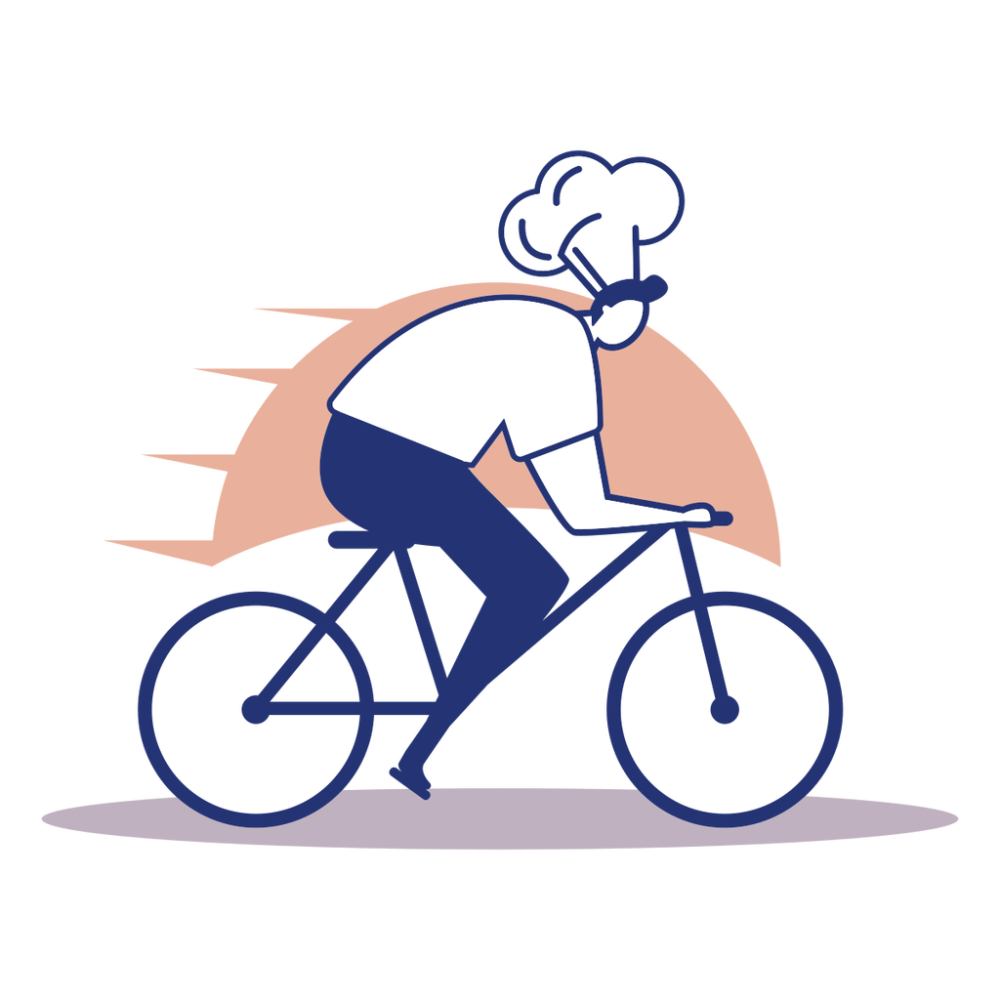

<head>
<link rel="apple-touch-icon" sizes="180x180" href="/apple-touch-icon.png">
<link rel="icon" type="image/png" sizes="32x32" href="/favicon-32x32.png">
<link rel="icon" type="image/png" sizes="16x16" href="/favicon-16x16.png">
<link rel="manifest" href="/site.webmanifest">
<link rel="mask-icon" href="/safari-pinned-tab.svg" color="#5bbad5">
<meta name="msapplication-TileColor" content="#da532c">
<meta name="theme-color" content="#ffffff">
</head>

## Hello, Oakland!
 
Thanks for the Valentine's Day 💌. We really appreciated you sharing some 💓 from coast to coast. Our team pulled together a few of our favorite [recipes](recipes.md) to show our gratitude.
 
 
**Stay safe**, and happy \(almost) spring 🌱🌺,
 
 
*The Mid-Atlantic Planning Team*
 
 

